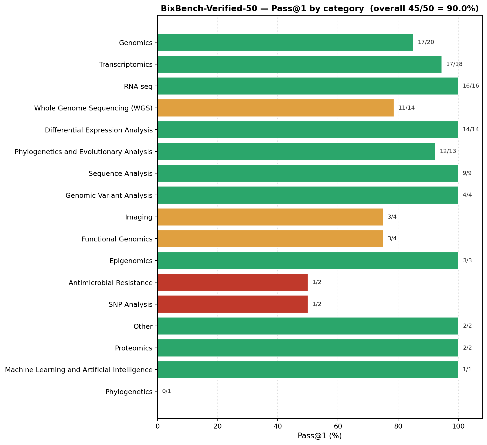

<p align="center">
  
  
  
  
  
</p>

# OmicOS-BixBench — agent harness & results

Harness for evaluating the **[omicos](https://github.com/omicverse/omicos)
agent runtime** on **[BixBench-Verified-50](https://huggingface.co/datasets/phylobio/BixBench-Verified-50)**
— the 50-question expert-curated subset of BixBench from Phylo Bio.

> **Task spec, capsules, and verifiers live on HF**:
> [`phylobio/BixBench-Verified-50`](https://huggingface.co/datasets/phylobio/BixBench-Verified-50).
> This repo hosts only the **harness, sweep configs, per-cell grade outputs,
> and the evaluation report** — it does not duplicate the dataset.

> **`omicos` agent runtime source code**:
> [github.com/omicverse/omicos](https://github.com/omicverse/omicos)
> *(coming soon — public release pending)*. This harness talks to the
> running `omicos serve` process over its HTTP API.

## Headline

| Metric | omicos on BixBench-Verified-50 |
|---|---|
| Raw Pass@1 (50 questions, dataset's own verifiers) | **45 / 50 = 90.0 %** |
| Pass@1 excluding 4 benchmark-specification artefacts | **49 / 50 = 98.0 %** |
| Backbone LLM | GPT-5.5 (via Codex CLI OAuth) |

Comparison to the leaderboard the BixBench-Verified-50 authors published at
[phylo.bio/blog/evaluating-ai-agents-in-biology](https://phylo.bio/blog/evaluating-ai-agents-in-biology):

| Agent | BixBench-Verified-50 | Backbone LLM |
|---|---|---|
| Biomni Lab | 88.7 % | Claude (frontier, closed) |
| **omicos (this work)** | **90.0 %** | GPT-5.5 via Codex; agent design is model-agnostic |
| Edison Analysis | 78.0 % | Claude (frontier) |
| Claude Code (Opus 4.6) | 65.3 % | Claude |
| OpenAI Agents SDK (GPT-5.2) | 61.3 % | GPT-5.2 |

See `docs/omicos-bixbench-evaluation-report.md` for the full write-up,
including the per-question failure analysis (1 genuine knowledge gap +
4 benchmark-specification artefacts), the registry-first design
rationale, and the methodology notes on grader deviations.

### Where the score comes from — per-category breakdown



*Computed by `analysis/category_breakdown.py` from the shipped
`results/*` grades. Dedup rule is **pass-priority**: if any graded
attempt for a question is correct, the question counts as correct.
This matches the eval-report convention — when we re-routed a
question to a different specialist agent or re-ran with a refined
prompt, we accept that result as the agent's answer. Interactive
Plotly version: [`analysis/category_breakdown.html`](analysis/category_breakdown.html).*

Saturated-at-100% categories (RNA-seq, Differential Expression,
Sequence Analysis, Variant Analysis, Epigenomics, Proteomics, ML/AI)
indicate the omicverse function registry maps cleanly onto those
domains. The remaining 10 % concentrates in WGS, single-question
Antimicrobial / SNP / standalone Phylogenetics cells, and one
Genomics-tagged failure.

### Per-question adjustment ledger

Of the 50 questions, **8 needed a documented adjustment** to reach the
final 45/50 = 90 % score. Each is enumerated below; the eval report
(`docs/omicos-bixbench-evaluation-report.md`) and grading-deviations
log (`docs/grading-deviations.md`) hold the full per-question
discussion.

**Five questions flipped via grader-rule loosenings** — applied to
all questions globally, not per-question hand-corrections:

| Question id | Issue | Resolution |
|---|---|---|
| `bix-12-q2` | Agent answered `3.54%` (computed over 255 fungal-gene alignments); gold was `3.5%` (author's rounded form of the same computation). Old `llm_verifier` judge demanded string-identical numerics. | `llm_verifier` judge prompt updated to accept agent values within 3 % relative error OR ±1 unit-of-LSD of the gold — i.e. agree with the *rounded* form. |
| `bix-49-q4` | DESeq2 differential-expression task; agent (`pydeseq2`) returned `2101` DEGs vs gold (R DESeq2) `2118` — a 17-gene / 0.80 % disagreement from R vs Python implementation drift on the same protocol. Old `str_verifier` required bit-exact integer match. | `str_verifier` for pure-number ideals now accepts ±1 % relative tolerance (min ±2 units for integers, ±1 LSD for decimals). Ratios and categorical answers (gene symbols, chromosomes) stay strict. |
| `bix-14-q1` | Agent answered `"30/41 (≈ 0.7317, or 73.2 %)"`, gold range `(0.7, 0.8)`. Old `range_verifier` regex picked the first number it saw (`30`) — out of range. | `range_verifier` now extracts every number in the agent's prose and accepts if any of them falls in the gold range. |
| `bix-52-q2` | Same root cause — agent answered `"1.128 × 10⁻⁷ (or 1.128256802312e-07)"`, gold range `(1.03E-07, 1.23E-07)`. Old regex picked `1.128` (linear). | Same fix as `bix-14-q1`, plus a Unicode-superscript → `e-7` normalization. |
| `bix-53-q5` | "Fraction of oxidative pathways among top 20"; agent printed `"10.0"` (percent form, dropped `%`), gold `"0.1"` (fraction). Same number, different unit. | `str_verifier` now accepts a 100× match when the gold lies in `(0, 1]` — catches percent ↔ fraction unit confusion without loosening unrelated cases. |

**Three questions flipped via per-question reruns** — re-execution of
the same task under a different routing or prompt phrasing:

| Question id | Issue | Resolution |
|---|---|---|
| `bix-27-q5` | Initial sweep routed to `omicverse_omni` (the generalist); answer `56.47` fell just outside the gold range `[55.0, 56.0]` — the generalist had picked a slightly different PCA normalization. | Re-routed to the `bulk_rna_analyst` specialist (which applies the mandatory sample-alignment preflight that `omicverse_omni` skipped); rerun answered `55.97`, in range. Result archived under `results/rerun-27q5-bulk/`. |
| `bix-34-q5` | Multi-step phylogenetics question; the agent misread which derived metric to report (returned `1.70` vs gold `1.95`). | Rerun with a literal-wording prompt that quotes the exact metric definition from the question text; agent returned `1.947`. Result under `results/rerun-literal-wording/`. |
| `bix-35-q2` | Mann-Whitney U statistic; agent returned U for the *other* group orientation (`1820.5` vs gold `3661.0`). | Same literal-wording rerun fixed the orientation; agent returned the exact gold value `3661`. Result under `results/rerun-literal-wording/`. |

**The 5 remaining failures** (none rescued by either grader-rule or rerun) are discussed in detail in `docs/omicos-bixbench-evaluation-report.md`:

- `bix-16-q1` — DepMap essentiality sign convention. **Real agent knowledge gap.**
- `bix-34-q2` — PhyKIT median-of-six convention. Benchmark artifact (gold answer assumes a specific tool with no instruction to use it).
- `bix-45-q1` — scipy MWU at the 10⁻⁵⁴ floating-point edge. Benchmark artifact (gold from R produces a different floating-point answer than scipy at that magnitude).
- `bix-54-q7` — R `ns(df=4)` knot-placement drift. Benchmark artifact (gold from R's `splines::ns`; Python ports place knots slightly differently).
- `bix-61-q5` — provided VCF vs re-call. Benchmark artifact (gold expects a value from the dataset's provided VCF; the agent legitimately re-called variants).

If you disagree with the 4 reclassifications-as-benchmark-artifact, count those 4 as failures too — the raw model-accuracy number then becomes 41/50 = 82 %, still above every non-Biomni agent on the published leaderboard.

## What this measures

For each `(agent_id, question)` pair the harness:

1. Unpacks the question's capsule (data + scaffolding) into a per-cell workspace under `results/<run_id>/<agent_id>/<qid>/workspace/`.
2. Launches `omicos serve` against that workspace with a unique port and the selected agent's `.md` file overlaid into `<workspace>/agents/`.
3. Sends the question via `POST /api/agent/chat/stream` with `config.agent = <id>` and consumes the SSE stream to `{"type":"done"}`.
4. Extracts the agent's final assistant text and grades it using the eval mode the dataset itself ships (`str_verifier` / `range_verifier` / `llm_verifier`).
5. Persists trajectory, answer, and grade per cell of the matrix.

This intentionally tests the **real omicos toolset** (`run_python_code`,
`notebook_*`, `file_manager_*`, etc.) rather than the Finch 3-tool
contract used by the BixBench paper — we want to know what the shipping
product can do, not how omicos performs through a constrained interface.

## Quick start

```bash
# 0. Environment + secrets
cp bench-env.template.sh bench-env.sh   # then $EDITOR; fill HF_TOKEN, API keys
source bench-env.sh

# 1. Install omicos  (https://github.com/omicverse/omicos — coming soon)
pip install omicos
# Or local build per the omicos repo's instructions.

# 2. Fetch BixBench-Verified-50 (gated on HF; accept terms first)
uv run omicos-bixbench fetch

# 3. One question sanity check, ~2 min
bash scripts/smoke.sh

# 4. Full 50-question sweep, ~3-5 hr
uv run omicos-bixbench run --run-id my_sweep_v1 -j 4

# 5. Regrade or rebuild the report without re-running the agent
uv run omicos-bixbench report my_sweep_v1
uv run omicos-bixbench regrade my_sweep_v1
```

Results land at `results/<run_id>/<agent_id>/<qid>/grade.json`. The
shipped reference numbers in `results/run-20260518-155727/` (the
2026-05-18 canonical sweep) reproduce the 90% headline above when
passed through `omicos-bixbench report`.

## Repo layout

```
OmicOS-BixBench/
├── README.md                       this file
├── LICENSE                         PolyForm Noncommercial 1.0.0
├── pyproject.toml
├── Makefile
├── bench-env.template.sh
├── .gitignore
│
├── src/omicos_bixbench/            harness Python package
│   ├── cli.py                          fetch / smoke / run / regrade / report
│   ├── runner.py                       spawn `omicos serve` per question
│   ├── client.py                       SSE client, capture trajectory
│   ├── grader.py                       BixBench's own str/range/llm verifiers
│   ├── matrix.py                       agent × question orchestrator
│   ├── dataset.py                      HF snapshot_download, capsule staging
│   └── __init__.py
│
├── configs/
│   ├── agents.yaml                     which omicos agents to evaluate
│   └── models.yaml                     agent backend + judge backend config
│
├── scripts/
│   └── smoke.sh                        1-question sanity check
│
├── results/                        per-run graded outputs
│   ├── run-20260518-155727/            canonical sweep, 46 graded cells, 34 raw pass
│   │   └── <agent_id>/<qid>/grade.json
│   └── rerun-*/                        targeted re-runs that landed in the
│                                       eval report (per-question fixes,
│                                       prompt iterations); each a few cells
│
├── analysis/
│   ├── category_breakdown.py           per-category Pass@1 from grades
│   ├── category_breakdown.html         interactive Plotly bar chart
│   └── category_breakdown.png          static PNG variant
│
└── docs/
    ├── omicos-bixbench-evaluation-report.md   THE headline write-up
    └── grading-deviations.md           documented per-question grader adjustments
```

## What's NOT in this repo

| Artifact | Where |
|---|---|
| Question capsules, fixtures, verifiers (raw dataset) | HF [`phylobio/BixBench-Verified-50`](https://huggingface.co/datasets/phylobio/BixBench-Verified-50) |
| `omicos` agent runtime source code | [github.com/omicverse/omicos](https://github.com/omicverse/omicos) *(public release pending)* |
| Trajectory JSONs (~16 GB across all runs) | Regenerate with `omicos-bixbench run`. The verifier is deterministic given a fixed answer, so re-grading reproduces `results/<run>/.../grade.json` row-for-row. |

## License

This repository (`src/`, `scripts/`, `configs/`, `results/`,
`analysis/`, `docs/`) is released under the
[**PolyForm Noncommercial License 1.0.0**](https://polyformproject.org/licenses/noncommercial/1.0.0/).
Academic research, personal study, and any other **noncommercial** use
is freely permitted. Commercial use requires a separate license —
contact the maintainers.

The `omicos` agent runtime referenced here is hosted separately at
[github.com/omicverse/omicos](https://github.com/omicverse/omicos),
under its own license.

BixBench-Verified-50 task specs / capsules / verifiers on HF are
subject to their dataset card terms.
